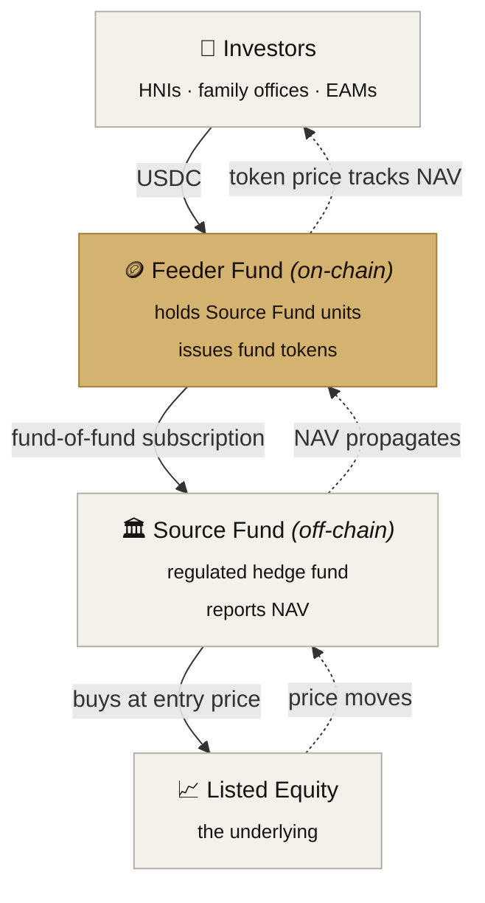
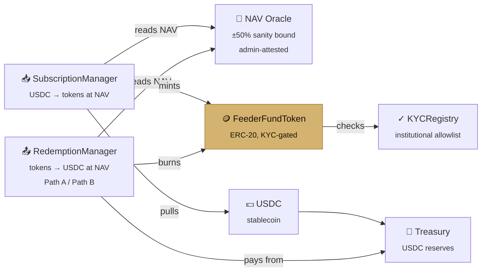
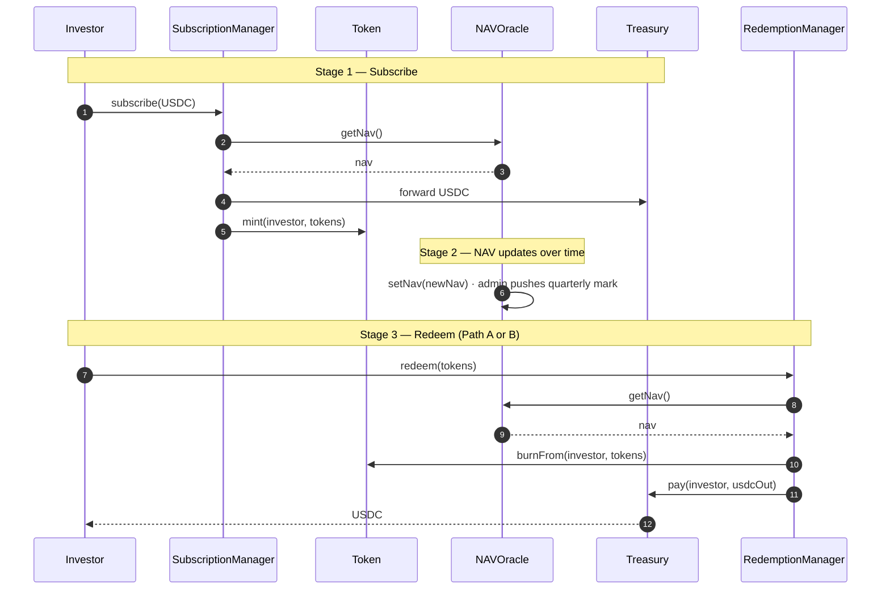

<div align="center">

# Tokenized RWA Fund

**Stablecoin-denominated tokens against off-chain hedge fund units. Token value tracks NAV.**

[](./LICENSE)
[](./contracts/test)
[](./contracts/contracts)
[](./app)
[](https://vercel.com/new/clone?repository-url=https%3A%2F%2Fgithub.com%2FOnesignature%2Ftokenized-rwa-fund&project-name=tokenized-rwa-fund&repository-name=tokenized-rwa-fund)

</div>

---

A working reference implementation of a **tokenized feeder fund**: investors send stablecoin and receive ERC-20 tokens whose value tracks an off-chain hedge fund's NAV. The on-chain layer never touches the regulated equity — only tokenizes claims on the fund's units.

The repository contains:

- **A documented design** for the structure, the peg mechanism, the compliance posture, and the path to launch
- **Audited-pattern smart contracts** (Solidity 0.8.24 + OpenZeppelin v5) with 42 passing tests including a full lifecycle integration
- **A production-quality demo frontend** (Next.js 14 + viem + RainbowKit) with both live and simulated modes
- **A guided 14-step tour** so non-technical viewers can run the full cycle in two minutes without a wallet

## The structure at a glance



NAV propagates back up the chain to set the token price. Shares in the listed company never pass to the feeder fund.

## Try it

Two ways:

| Mode | URL | Setup | What it does |
|---|---|---|---|
| **Simulation** | `/simulate` | None — just visit | Full lifecycle in your browser, no wallet needed, guided tour included |
| **Live** | `/app` | Wallet + Sepolia (or local Hardhat node) | Real on-chain transactions against deployed contracts |

The simulation is the recommended path for first-time viewers. Hit **"Try the demo"** on the landing page and follow the gold-bordered tour card.

## Quickstart

Prerequisites: Node 20+, npm, git.

```bash
# 1. Install + test the contracts
cd contracts
npm install
npm test            # 42 passing

# 2. Spin up a local node and deploy
npm run node                                # terminal A
npm run deploy:local                        # terminal B

# 3. Run the frontend (from repo root)
cd ..
cp .env.example .env.local
npm install
npm run dev
# → http://localhost:3000
```

The deploy script writes contract addresses to `lib/deployment.json` automatically, so the frontend picks them up without manual wiring.

## Repository layout

```
.
├── docs/                        ← concept, architecture, peg, lifecycle, compliance, roadmap
├── contracts/                   ← Hardhat project (Solidity + tests + deploy)
│   ├── contracts/               ← MockUSDC, KYCRegistry, NAVOracle, FeederFundToken,
│   │                              Treasury, SubscriptionManager, RedemptionManager
│   ├── test/                    ← unit + Lifecycle integration tests
│   └── scripts/                 ← deploy.ts, demo-cycle.ts
├── app/                         ← Next.js 14 (App Router)
│   ├── page.tsx                 ← landing page
│   ├── app/                     ← live dashboard, subscribe, redeem
│   └── simulate/                ← simulation dashboard + guided tour
├── components/                  ← NavHero, PositionCard, ActivityFeed, AdminPanel, TourGuide, …
├── contexts/                    ← LiveFundProvider + SimulatedFundProvider (unified FundContext)
├── hooks/                       ← useFund, useTourSpotlight
├── lib/                         ← abis, format, deployment.json, wagmi config
├── package.json                 ← Next.js app dependencies
├── LIMITATIONS.md               ← honest audit of what the MVP does and does not handle
└── README.md                    ← you are here
```

## Architecture



| Contract | Responsibility |
|---|---|
| `MockUSDC` | 6-decimal ERC-20 with open faucet (testnet only) |
| `KYCRegistry` | Owner-controlled allowlist of approved addresses |
| `NAVOracle` | Stores NAV; only `updater` writes; ±50% per-update sanity bound; full event log |
| `FeederFundToken` | ERC-20 fund token; transfer-gated by KYC; mint/burn restricted to managers |
| `Treasury` | Holds USDC reserves; only authorized payers move funds out |
| `SubscriptionManager` | Accepts USDC, mints tokens at the current NAV |
| `RedemptionManager` | Burns tokens, pays USDC at NAV (with optional Path B discount) |

Deeper detail in [`docs/02-architecture.md`](./docs/02-architecture.md).

## Token lifecycle



Full numeric walk-through in [`docs/04-token-lifecycle.md`](./docs/04-token-lifecycle.md).

## Deploy to Vercel

The Next.js app lives at the repo root, so Vercel auto-detects it. No special configuration needed.

1. Click the **Deploy with Vercel** button at the top of this README (or fork + import manually)
2. No environment variables required for the simulation to work — `/simulate` runs entirely in the browser
3. After deploy, visit `https://your-app.vercel.app/simulate` to try the demo

To make `/app` work on the deployed site you need to:

1. Deploy the contracts to a public network (Sepolia is supported out of the box)
   ```bash
   cd contracts
   cp .env.example .env       # fill SEPOLIA_RPC_URL + PRIVATE_KEY
   npm run deploy:sepolia
   ```
2. Commit the regenerated `lib/deployment.json`
3. Push — Vercel will redeploy automatically

Until then, `/app` shows a banner pointing visitors to `/simulate`.

## Status

This is a **working MVP**, not production code. Contracts have unit + integration test coverage but have **not** been audited.

- **What's covered:** [`LIMITATIONS.md`](./LIMITATIONS.md) — the honest list of edge cases the MVP handles and the ones it doesn't
- **Path to production:** [`docs/07-roadmap.md`](./docs/07-roadmap.md) — Phase 0 (build-vs-partner conversations) → Phase 4 (multi-cycle scale)

## Docs

| Doc | What it covers |
|---|---|
| [01-concept.md](./docs/01-concept.md) | The thesis, the target investor, why a feeder fund |
| [02-architecture.md](./docs/02-architecture.md) | The four-layer stack, value flow, on-chain vs off-chain split |
| [03-peg-mechanism.md](./docs/03-peg-mechanism.md) | NAV oracle, mint/burn, market-maker arbitrage |
| [04-token-lifecycle.md](./docs/04-token-lifecycle.md) | Subscribe, NAV tracking, exit paths A and B |
| [05-compliance.md](./docs/05-compliance.md) | KYC/AML model, transfer gating, jurisdictional posture |
| [06-build-vs-partner.md](./docs/06-build-vs-partner.md) | Proprietary build vs KAIO / Securitize |
| [07-roadmap.md](./docs/07-roadmap.md) | Pilot → scale plan |
| [LIMITATIONS.md](./LIMITATIONS.md) | Honest audit of MVP gaps and their production fixes |

## Tech stack

**Contracts**
- Solidity 0.8.24
- OpenZeppelin Contracts v5
- Hardhat + TypeScript + viem-based tests (42 passing)

**Frontend**
- Next.js 14 (App Router)
- TypeScript
- Tailwind CSS with custom dark fintech theme
- wagmi v2 + viem + RainbowKit
- React Context for unified Live/Simulated state

**Design**
- Inter (UI), Instrument Serif (display), JetBrains Mono (numbers)
- Single signature accent: warm institutional gold

## License

[MIT](./LICENSE)

---

<div align="center">

Built as a reference implementation, not financial advice. Not an offer to sell securities.

</div>
