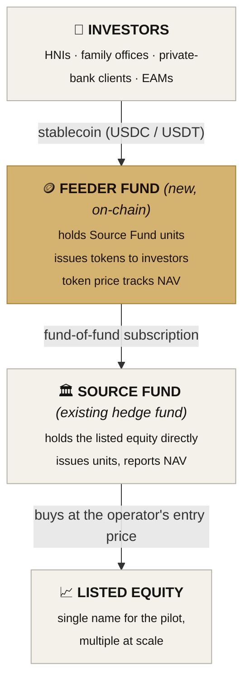
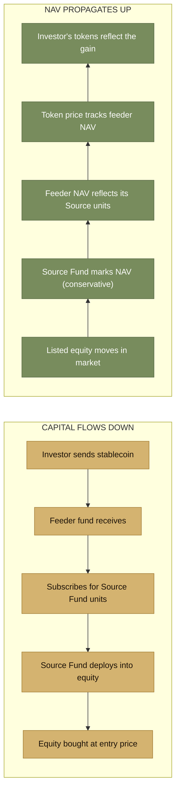

# 02 — Architecture

## The four-layer stack



NAV propagates back up the chain to set the token price.

## Roles

**Source Fund (existing).** A regulated hedge fund domiciled in an established jurisdiction. Holds listed equity in target markets. Issues units to its investors. Reports NAV on a periodic cadence.

**Feeder Fund (new).** A new entity, set up specifically to hold Source Fund units and tokenize them. Acts as a single institutional investor in the Source Fund. Issues tokens to its own investors against its holding. Operates the stablecoin treasury, the fiat off-ramp banking relationships, and investor onboarding.

**Market Maker (external).** A counterparty whose job is to maintain orderly token pricing in the market. When tokens drift away from the NAV-implied price, the market maker arbitrages the gap. May also play a role in the buyback at exit (Path B).

**Listed Equity (the underlying).** A specific listed company that the Source Fund has bought into. Held inside the Source Fund throughout. Never passes to the feeder fund and never tokenized directly.

## On-chain vs off-chain split

Everything that touches regulated equity stays off-chain. Everything that touches investor capital and token issuance is on-chain.

```
                  OFF-CHAIN                        ON-CHAIN
                  ─────────                        ────────
   Source Fund administration            Stablecoin treasury
   Listed equity custody                 Token mint and burn
   NAV calculation (published periodically) NAV oracle (reads the published NAV)
   Institutional KYC of investors        KYC registry (allowlist)
   Fiat banking rails                    Subscription / redemption logic
   Audit, regulator reporting            Transfer gating
                                         Event log (transparent ledger)
```

The NAV oracle is the bridge. Off-chain, the fund administrator publishes a NAV per unit. On-chain, an authorized updater (in production, a multisig governed by the administrator's process) writes that value into the oracle contract. Every other on-chain mechanism reads from this single source.

## Capital and value flow



## Why tokenize fund units, not the equity directly

Several existing platforms tokenize listed equity directly through a 1:1 backing model (a broker-dealer holds the shares, tokens are issued against the custody). This is feasible but operationally heavy. More importantly, it makes the tokenizing entity a registered shareholder in the listed company, with all the regulatory consequences that follow in every listing jurisdiction.

By tokenizing units in a regulated fund instead, the protocol sidesteps all of this. The feeder fund is just one more institutional investor in the Source Fund, indistinguishable from any other institutional subscriber. The blockchain layer never touches the listed equity. Everything regulated about the listed shares stays inside the regulated fund wrapper.

This is the same structural pattern used by Securitize for KKR, Hamilton Lane, and BlackRock BUIDL. It is a proven model.

## On-chain components (this MVP)

The MVP implements the on-chain portion of the architecture above:

| Component | Contract | Responsibility |
|---|---|---|
| Stablecoin | `MockUSDC.sol` | Test USDC for the demo |
| KYC | `KYCRegistry.sol` | Owner-controlled allowlist of approved investors |
| NAV oracle | `NAVOracle.sol` | Stores the current NAV per token; only an authorized updater can write |
| Token | `FeederFundToken.sol` | ERC-20 fund token; transfer-gated by KYC |
| Subscription | `SubscriptionManager.sol` | Accepts USDC, mints tokens at NAV |
| Redemption | `RedemptionManager.sol` | Burns tokens, pays USDC at NAV (with optional discount for Path B) |

These contracts compose into the full lifecycle in [04-token-lifecycle.md](./04-token-lifecycle.md).
