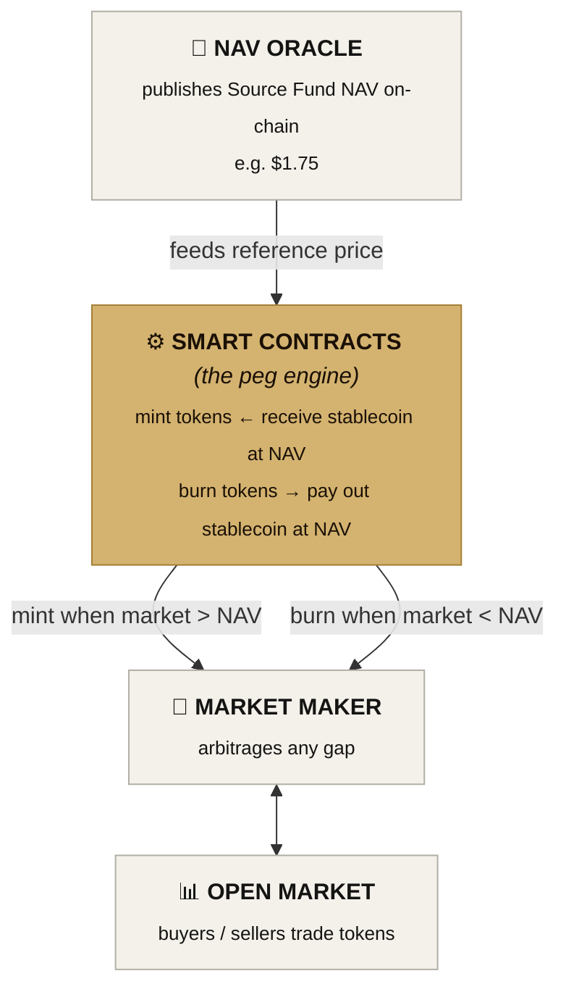

# 03 — Peg Mechanism

The architecture in [02-architecture.md](./02-architecture.md) says the token price tracks the feeder fund's NAV. This doc explains how that actually happens.

## The problem

The Source Fund publishes a NAV. The NAV says, today, the feeder fund's per-token value is (e.g.) $1.75. But tokens trade in an open market — anyone holding a token can sell it to anyone willing to buy. Nothing automatic forces the trade price to equal $1.75. If sentiment turns and a holder dumps a large block, the trade price could fall to $1.50. If demand spikes, it could rise to $2.00.

The peg mechanism is the set of forces that keep the trade price close to the published NAV.

## Three mechanisms

Three mechanisms work together. Each is well-understood in the stablecoin and tokenized-fund industry.

### Mechanism 1: the NAV oracle

An oracle is software that brings off-chain information onto a blockchain. In this design, the off-chain information is the Source Fund's NAV.

When the Source Fund administrator marks the NAV at $1.75, the oracle publishes that figure to the smart contract that runs the token. The smart contract now has an authoritative reference price. Every other peg mechanism depends on this reference.

**Oracle design notes:**

- The MVP uses a single-source admin-updated oracle: an authorized address (the `updater`) calls `setNav(newValue)`. This is appropriate for a controlled feeder fund where the NAV is published by a single administrator.
- Production-grade oracles should add: multiple independent data sources, multisig governance over the updater role, a sanity bound on each update (the MVP includes a ±50% bound), and circuit breakers that pause subscriptions and redemptions if the posted value looks anomalous.
- Chainlink, Pyth, and RedStone all offer production-grade infrastructure for this pattern.

The oracle is a high-value target. If a malicious actor controls what the oracle reports, they can mint tokens cheaply or extract value at redemption. The threat model for this protocol treats the oracle as the most security-sensitive component.

### Mechanism 2: mint and burn against NAV

This is the core peg mechanism, modeled directly on how DAI holds its peg to $1.

The smart contracts allow authorized parties to do two things:

- **Mint.** Send stablecoin to the contract and receive newly minted tokens at the NAV-implied price. If NAV is $1.75 and an actor sends $175, they receive 100 freshly minted tokens. Token supply expands.
- **Burn.** Send tokens to the contract and receive stablecoin at the NAV-implied price. If an actor sends in 100 tokens at NAV of $1.75, they receive $175. Tokens are destroyed. Token supply contracts.

This creates a powerful arbitrage. If tokens trade in the open market at $1.50 while NAV is $1.75, a market maker can buy tokens at $1.50, burn them at the contract, and receive $1.75 — a profit of $0.25 per token. This continues until the market price rises back to NAV. The mirror works on the other side.

**Who can mint and burn:**

- In the MVP, anyone on the KYC allowlist can subscribe (mint by sending stablecoin) and anyone holding tokens can redeem (burn). This is the simplest model.
- In production, fine-grained access might restrict large mint/burn operations to a designated market maker, with retail investors going through a wider subscription/redemption window. This is a design choice, not a structural requirement.

### Mechanism 3: market making and liquidity

Mint-and-burn is the long-run anchor. Market making is the short-run smoothing.

A dedicated market maker quotes two-sided prices in the token, narrowing the bid-ask spread and absorbing temporary imbalances. When a large seller appears, the market maker buys tokens onto its inventory and gradually unwinds; when a large buyer appears, the market maker draws on its inventory.

Without this, even a healthy peg mechanism can produce ugly intraday price swings. Mint-and-burn corrects large deviations but isn't free — gas costs and oracle latency mean small deviations can persist briefly. The market maker handles those.

The market maker also plays a role at exit, particularly in Path B (fresh raise plus token buyback). See [04-token-lifecycle.md](./04-token-lifecycle.md).

The MVP does not include a market maker contract. The mint/burn primitive is sufficient for the demo. In production, the market maker is an external counterparty (e.g. a crypto-native firm with inventory across major venues).

## Why automated peg management

In equity markets, the operator is comfortable with hands-on price involvement: identifying when a stock is mispriced, working with the company on the timing of placements. In the on-chain layer, the operator has explicitly stepped back from this. The peg is automated. The smart contracts enforce it. The market maker arbitrages it.

This is a deliberate decision. Manual price management in a tokenized public-facing instrument creates regulatory and reputational risk. Automation removes those risks.

The trade-off is that the token will sometimes briefly trade away from NAV, particularly during periods of extreme market stress, until the arbitrage closes the gap. This is acceptable. The alternative is worse.

## Failure modes and mitigations

| Failure | Mitigation |
|---|---|
| Oracle manipulation | Multisig over updater, sanity bound on updates, circuit breaker on anomalous values |
| NAV update front-running | Brief pause on subscriptions/redemptions around NAV update (not in MVP, would be in production) |
| Market maker inventory exhaustion | Mint-and-burn primitive remains available; peg arbitrage still functions, just with wider spread |
| Stablecoin depeg | Treasury policy: diversify across USDC and USDT, hold reserves with regulated custodian, document depeg response |
| Smart contract bug | Audit before mainnet, bug bounty, non-upgradeable core logic with timelocked admin actions |
