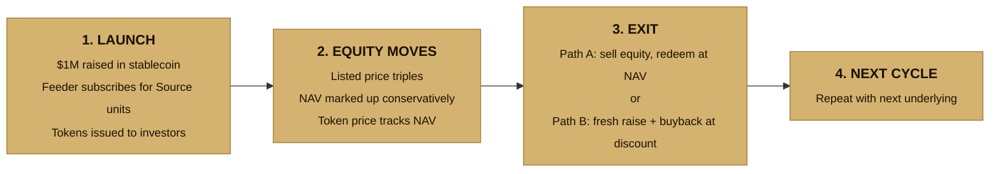
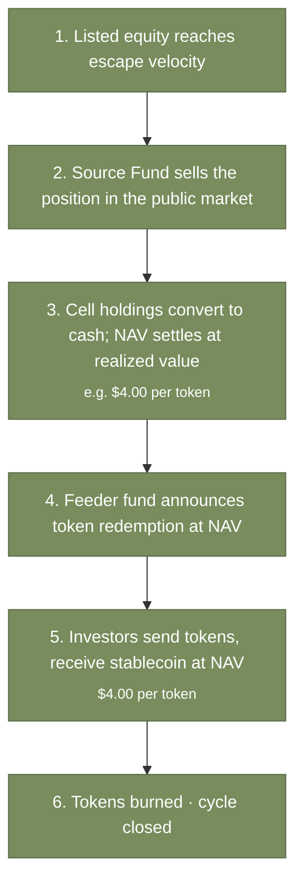
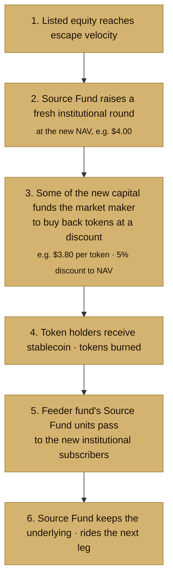

# 04 — Token Lifecycle

This doc walks through the full lifecycle of a single tokenized position with worked numbers. Numbers are illustrative.

## The four stages

## Stage 1: Launch and subscription

The feeder fund opens for subscription with a pilot allocation of $1M.

Investors send stablecoin to the `SubscriptionManager`. Suppose the Source Fund's relevant cell has a current NAV per unit of $100, and the feeder fund subscribes into that cell with the $1M collected. The feeder fund receives 10,000 Source Fund units. That holding is its only material asset.

The feeder fund issues 1,000,000 tokens. Each token represents 1/1,000,000 of the fund's holding. At launch, with the fund's NAV at $1M, each token is priced at $1.

Investors receive tokens proportional to their subscription:
- A $10,000 investor receives 10,000 tokens
- A $250,000 investor receives 250,000 tokens

All of this happens through smart contracts. No paper, no T+2 settlement, no broker.

## Stage 2: The equity moves

Over twelve months, the listed share price triples (a re-rating as the operating story plays out). The mark-to-market value of the Source Fund's underlying position has tripled.

**What a typical mark-to-market fund would do.** Update NAV to reflect current market price immediately. Token NAV would move from $1.00 to roughly $3.00.

**What the Source Fund does instead.** Marks NAV conservatively, on a private-equity-style cadence even though the underlying is technically liquid. The administrator marks the NAV up by ~15% per quarter. By the end of year one, published NAV per token has risen from $1.00 to roughly $1.75.

|                       | Start of year | End of year | Change |
|---|---|---|---|
| Implied mark-to-market token NAV | $1.00 | $3.00 | +200% |
| Published token NAV (conservative) | $1.00 | $1.75 | +75% |

The gap between published NAV ($1.75) and mark-to-market ($3.00) is **the deliberate design**. Two reasons:

1. **Smoothing.** In smaller listed names, the listed price overshoots before settling. Marking NAV every time the price moves would whipsaw investors who subscribe or redeem on a given day, exposing them to short-term price noise that has nothing to do with the underlying business.

2. **Reserved upside for unit-holders.** Conservative marking creates a deliberate gap between the published NAV (what investors enter and exit at) and the mark-to-market value (what the position is worth). That gap belongs proportionally to all unit-holders. As the Source Fund marks up over future quarters, the NAV catches up to mark-to-market, and that catch-up is how investors realize the gain.

**On the on-chain layer.** The NAV oracle is updated each time the Source Fund publishes a new NAV. Token price tracks. An investor who bought tokens at $1.00 has a 75% paper gain after one year. New investors subscribing at $1.75 buy a position whose implied mark-to-market is closer to $3.00 — they're buying the unrealized gain with the same catch-up dynamic ahead.

## Stage 3: Choosing how to exit

Eighteen months in, the listed equity reaches escape velocity: financial track record is now public and audited, institutional research desks have picked up coverage, and the listed price has run further. Two exit paths are available.

### Path A: Equity sale

**Path A numbers.** Source Fund sells the position; cell NAV settles at $4.00 per token. The feeder fund's 1,000,000 tokens outstanding redeem at $4.00 each. An investor who bought at $1.00 receives $4.00 (4x return). An investor who bought at $1.75 receives $4.00 (2.3x return). Tokens are burned; the cycle closes.

### Path B: Fresh raise plus buyback

**Path B numbers.** Source Fund keeps the equity but raises a fresh $4M institutional round at NAV of $4.00. Some of that fresh capital is used to buy back the existing token supply at $3.80 per token (a 5% discount to NAV). Token holders receive stablecoin; tokens burned; the feeder fund's units in the Source Fund are passed to the new institutional subscribers.

Token investors get an exit at $3.80 per token regardless of when they entered — meaningful gains for early holders, modest gains for late holders, and a clean stablecoin exit they didn't have to source liquidity for. The Source Fund keeps the underlying position and rides the next leg.

### Which path, and why both?

Path A is simpler. Path B is more capital-efficient because the Source Fund keeps the underlying position; the operator uses the exit window to recycle into new institutional capital without selling the underlying.

Both paths leave every party made whole in stablecoin terms.

## Stage 4: Next cycle

Once the first cycle is complete, the feeder fund opens for the next underlying. This might be another listed name in the same market, a position in a different market, or a new tokenized cell. Each cycle teaches the team something about token mechanics, market making, and investor behavior. At scale, the feeder fund itself becomes a brand: the place where you can get fractional, stablecoin-denominated exposure to the operator's listed-equity work.

## On-chain implementation in this MVP

The MVP contracts implement all of the above:

| Stage | Contracts involved |
|---|---|
| Stage 1 — subscribe | `SubscriptionManager.subscribe()` pulls USDC, mints tokens at the oracle's NAV |
| Stage 2 — NAV update | `NAVOracle.setNav()` is called by the authorized updater; subscribe/redeem prices update automatically |
| Stage 3 Path A — redeem at NAV | `RedemptionManager.redeem()` with discount = 0 |
| Stage 3 Path B — redeem at discount | `RedemptionManager.redeem()` with discount set (e.g. 500 bps for 5%) |

The full lifecycle is covered by the integration test in `contracts/test/Lifecycle.test.ts`.
